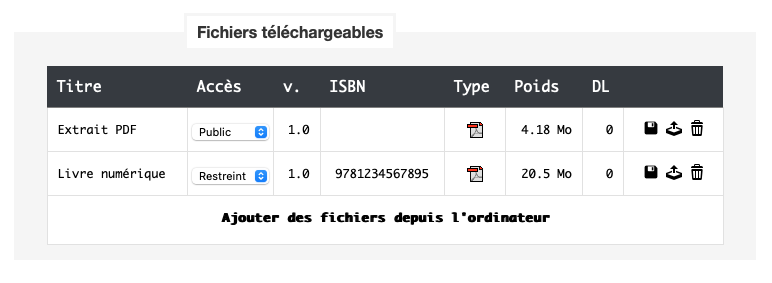

import FloppyDiskIcon from '~icons/fa6-solid/floppy-disk';

Chaque article peut se voir associer des fichiers téléchargeables.

Il en existe deux types :
- les fichiers en accès **public** (extraits, bonus, etc.) qui sont téléchargeables librement depuis la page de l'article ;
- les fichiers en accès **restreint** (livres numériques, livres audio, etc.) qui ne sont téléchargeables qu'après
  ajout de l'article à la bibliothèque.

### Associer un fichier téléchargeable à un article

Il est possible d'associer plusieurs fichiers téléchargeables à un seul article. Si plusieurs fichiers de type restreint
sont associés à un même article, l'utilisateur les verra tous apparaîtra dans sa bibliothèque après et pourra choisir le
fichier de son choix.

1. Se rendre sur la fiche de l'article auquel sera associé le fichier.
2. Cliquer sur **Modifier** en bas à droite.
3. Dans la selection *Fichiers téléchargeables*, cliquer sur **Ajouter des fichiers depuis l'ordinateur**.
4. Sélectionner le(s) fichier(s) sur votre disque et cliquez sur **Ouvrir**.
5. Une fois le(s) fichier(s) téléchargé(s), sélectionner les options adéquates
   (voir [Options](#options-des-fichiers-téléchargeables)).
6. Une fois les options modifiées, cliquer sur l'icône <FloppyDiskIcon class="icon"/> pour enregistrer les modifications, puis **Valider**
   la fiche.

:::caution[N'oubliez pas d'enregistrer chaque fichier]
Les fichiers téléchargeables sont enregistrés indépendamment de la fiche article. Valider la fiche n'est pas
suffisant, il faut bien cliquer sur l'icône <FloppyDiskIcon class="icon"/> en regard de chaque fichier téléchargeable ajouté ou modifié.
:::

### Options des fichiers téléchargeables

Une fois le nouveau fichier téléchargé sur le serveur, les champs suivants sont remplis automatiquement et ne sont pas
modifiables : **Type**, **Poids**, **DL** (nombre de téléchargements).

Pour chaque fichier téléchargeable, il est possible de modifier les options suivantes.

##### Titre

Le titre est le nom sous lequel apparaîtra le fichier dans la bibliothèque de l'utilisateur. Le titre de l'article
étant déjà affiché, il n'est pas nécessaire de le répéter ici, mais si plusieurs formats sont disponibles pour un
même article, il peut être utile de préciser le format du fichier (par exemple : "PDF", "ePub").

##### Accès

Le droit d'accès au fichier, public ou restreint, influe sur la manière dont le fichier sera accessible à l'utilisateur,
soit en libre téléchargement depuis la fiche de l'article (public), soit après ajout (gratuit ou payant) de l'article à la
bibliothèque de l'utilisateur (restreint). Cf. [Droits d'accès](#droit-daccès-des-fichiers-téléchargeables)).

##### Version ("v.")

Le numéro de version du fichier est utilisé pour indiquer aux utilisateurs qu'une nouvelle version du fichier est
disponible. Il est conseillé d'incrémenter ce numéro à chaque fois qu'une nouvelle version du fichier est mise en ligne.
Cf. [Mettre à jour un fichier téléchargeable](#mettre-à-jour-un-fichier-téléchargeable).

##### ISBN

Le code ISBN associé à ce fichier en particulier. Il peut être utile de renseigner ce champ si vous disposez de codes
ISBNs différents pour les différents formats d'un même article (par exemple, un ISBN pour le format ePub et un ISBN
pour le format PDF). Si vous n'avez pas de code ISBN spécifique pour ce fichier, laissez ce champ vide et utiliser le
champ général ISBN/EAN de la fiche article.

Une fois les options d'un fichier modifiées, cliquer sur l'icône <FloppyDiskIcon class="icon"/> pour enregistrer les
modifications relatives à ce fichier.

### Droit d'accès des fichiers téléchargeables

Un concept important associé aux fichiers téléchargeables est celui du droit d'accès. Pour chaque fichier, vous aurez à
choisir entre deux options :

* **Public** : le fichier peut être téléchargé librement depuis la fiche du livre. Cette option est à choisir pour les
  extraits gratuits, les bonus, les fiches de présentation, etc. ;
* **Restreint** : avant de télécharger le fichier, l'utilisateur devra l'ajouter à sa bibliothèque, ce qui nécessite de
  posséder un compte utilisateur avec une adresse e-mail validée. Si le prix de l'article associé est à 0, l'utilisateur
  pourra ajouter le fichier gratuitement à sa bibliothèque, sinon, le fichier ne sera disponible qu'après enregistrement
  d'une commande et validation du paiement.

### Mettre à jour un fichier téléchargeable

Si vous souhaitez mettre en ligne une nouvelle version du fichier, plutôt que de le supprimer et d'en créer en nouveau,
vous pouvez remplacer le fichier déjà en ligne en cliquant sur l'icône "upload". Le compteur de téléchargement sera
conservé et les utilisateurs ayant l'article dans leur bibliothèque verront qu'une nouvelle version du fichier est
disponible.

Une fois le nouveau fichier en ligne, incrémentez le **numéro de version** pour déclencher l'apparition d'une
notification dans la bibliothèque des utilisateurs ayant déjà téléchargé une ancienne version du fichier.
