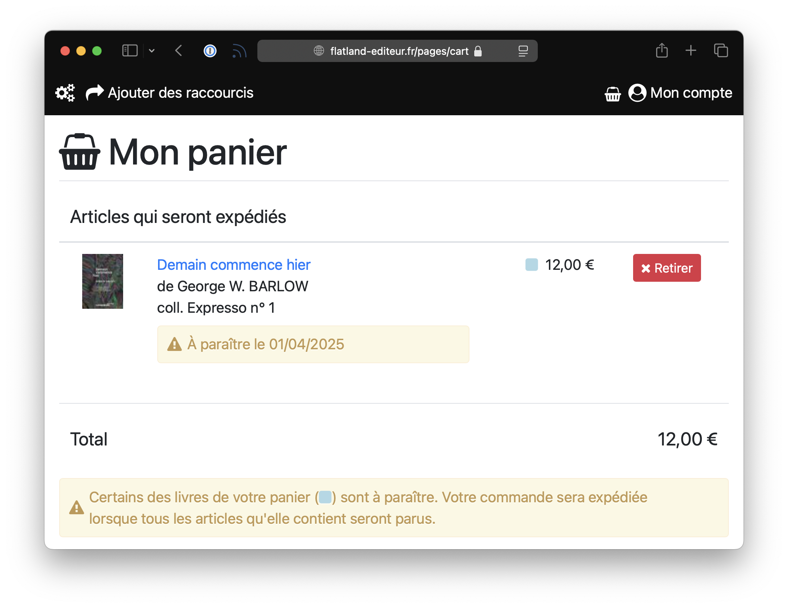
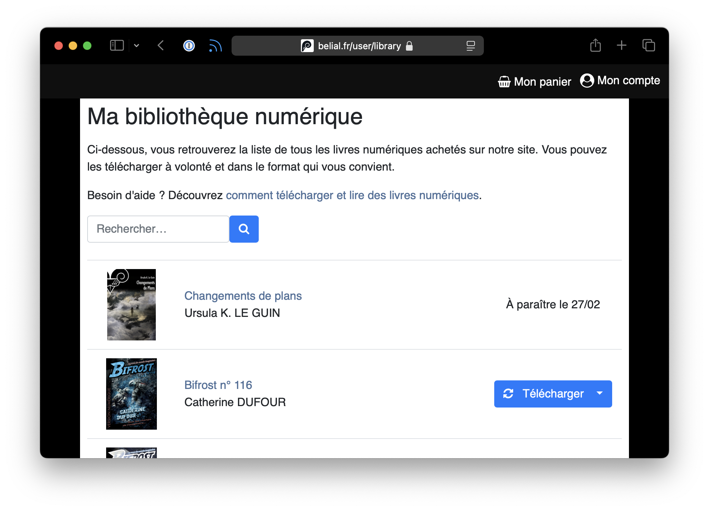

Biblys permet de proposer un article à la précommande.

Si au moins un article en précommande est ajouté au panier, alors il apparaîtra dans le panier avec sa date
de parution, ainsi qu'un rappel que la commande dans son ensemble ne sera expédiée que lorsque l'article sera paru.

## Activer la précommande d'un article

L'ajout d'une date de parution dans le futur à un article le fait basculer en mode "À paraître" et empêche son ajout
au panier. La procédure pour activer la précommande d'un article dépend de la nature de l'article et de la configuration
du site.

### Articles physiques à expédier

#### Stock réel

Si le site est configuré en mode [stock réel](/configurer/stock-virtuel/) (par défaut), les
articles précommandés seront décomptés du stock. Il faut donc ajouter des exemplaires au stock de cet article pour que
l'article soit commandable, même si l'on ne dispose pas encore physiquement des exemplaires.

#### Stock virtuel

En mode stock virtuel, la case **Précommande** de l'article doit être cochée. C'est ce qui permettra la création
dynamiques des exemplaires lors de l'ajout au panier, malgré la date de parution dans le futur.

### Articles téléchargeables

Pour les articles téléchargeables comme les livres numériques, la case **Précommande** doit être cochée. C'est ce qui
permettra l'ajout d'un article téléchargeable au panier malgré sa date de parution dans le futur. 

Lors du paiement d'une commande contenant un article téléchargeable en précommande, celui-ci est ajouté immédiatement 
à la bibliothèque numérique, mais le bouton de téléchargement est remplacé par la date de parution jusqu'au jour J.

:::tip[Téléchargement avant parution]
Les invitations de téléchargement permettent de donner accès au téléchargement d'un article même avant sa date de 
parution, par exemple pour envoyer des services de presse numérique.
:::
