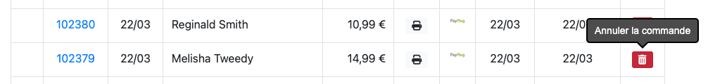

:::tip[Seul·e un·e administrateur·ice peut annuler une commande.]
Si vous êtes un·e client·e et que vous souhaitez modifier votre commande
enregistrée sur un site Biblys, veuillez utiliser la page **Contact** pour contacter un·e responsable du site.
:::

Pour annuler une commande, rendez-vous sur la page **Commandes** de l'administration, puis cliquez sur le bouton
**Annuler** en fin de ligne. Après confirmation, la commande sera annulée.

Lorsqu'une commande est annulée :

- les exemplaires physiques de la commande sont remis en stock et peuvent à nouveau être vendus (uniquement en mode "
  stock réel") ;
- les articles téléchargeables sont retirées de la bibliothèque numérique de l'utilisateur·ice qui ne peut plus les
  télécharger ;
- la commande n'est pas supprimée, mais elle acquiert un statut annulé et n'est plus prise en compte dans le calcul du
  chiffre d'affaires ;
- un courriel de confirmation d'annulation de la commande est envoyé à l'utilisateur·ice.

:::caution[Remboursement de la commande]
Une commande annulée n'est pas automatiquement remboursée. Le remboursement doit être effectué manuellement, soit via
l'interface du prestataire de paiement dans le cadre d'un paiement par carte bancaire, soit à l'aide d'un autre moyen de
paiement.
:::
