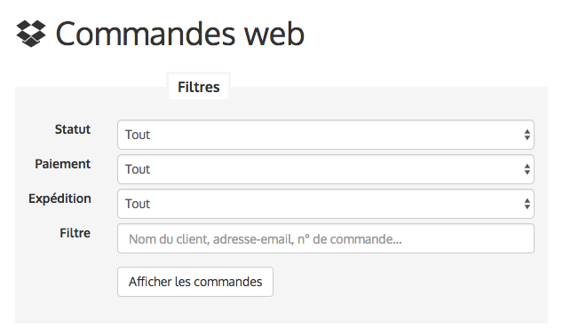
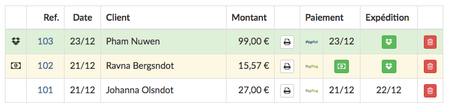

Vous venez de recevoir votre première commande, félicitations !

Voici comment utiliser l'outil de gestion des commandes intégré à Biblys.

## Courriel de notification de commande

Lorsqu'un client enregistre une commande, il reçoit instantanément un courriel de notification, dont l'objet contient le
numéro de commande. Ce courriel contient un récapitulatif du contenu de la commande, l'adresse d'expédition, un lien
vers la page de commande sur le site et une invitation à la payer.

En tant qu'administrateur du site, vous recevrez une copie exacte de ce courriel. Cela vous permet d'être informé qu'une
nouvelle commande vient d'être enregistrée.

Attention ! La réception de ce courriel n'implique pas nécessairement que la commande a déjà été payée. Avant d'expédier
la commande, attendez d'avoir reçu l'avis de paiement ou fiez-vous à l'outil**Commandes** de l'administration pour
connaître son statut.

## Outil **Commandes** de l'administration

Cet outil recense toutes les commandes enregistrées sur votre site et vous permet de les gérer. C'est ici que vous
pourrez vérifier leur état (en attente de paiement, en attente d'expédition, etc.) ou le modifier (marquer comme
expédiée, annuler, etc.).

L'outil propose un certain nombre de filtres qui permet de n'afficher que certaines commandes : par statut (à payer, à
expédier, à mettre à disposition, annulées) par mode de paiement ou d'expédition. Par exemple, il peut être utile, lorsque
vous avez un grand nombre de commandes à expédier, de n'afficher que celles-ci. Le filtre libre permet de rechercher une
commande particulière par nom du client, adresse e-mail ou numéro de commande.

Par défaut, l'outil affiche un tableau des 100 dernières commandes sauf celles annulées, qu'il est possible d'afficher
grâce au filtre de statut.

La première case indique par une icône le statut de la commande :

* pour une commande en attente d'expédition (fond vert)
* pour commande en attente de mise à disposition en magasin (fond vert)
* pour une commande en attente de paiement (fond jaune)
* pour une commande non-payée à relancer (fond rouge)
* pour une commande non-payée qui a été relancée (fond blanc)
* pour une commande annulée (ligne barrée)
* aucune icône pour une commande traitée (payée et expédiée, fond blanc)

Le reste de la ligne indique le numéro de la commande, la date d'enregistrement, le nom du client, le montant, les
informations de paiement et d'expédition. Un clic sur le numéro permet d'accéder au détail de la commande. Un clic sur
le bouton permet d'accéder à une facture imprimable.

## Commandes en attente de paiement

Une commande enregistrée apparaît immédiatement dans l'administration, sous le statut **En attente de paiement**,
signalée par l'icône et un fond jaune.

La section paiement de chaque ligne de commande est divisée en deux parties, l'une pour indiquer le mode de paiement
choisi, l'autre indiquera la date de paiement si la commande a déjà été payée, sinon un bouton pour marquer
manuellement la commande comme payée.

* Si le client fait le choix d'un paiement par chèque, virement ou espèce (dans le cas d'un retrait en magasin), la
  commande apparaîtra dans l'administration en attente de paiement. C'est à vous de la marquer comme payée, lorsque vous
  recevez le paiement, en cliquant sur le bouton et en choisissant le mode de paiement adéquat. Le client recevra alors
  un courriel l'informant que le paiement de sa commande a bien été reçue.
* Si le client fait le choix d'un paiement par carte bancaire, le prestataire de paiement enverra une notification à
  Biblys une fois le paiement réussi et la commande apparaitra automatiquement comme payée. Si le paiement échoue pour
  quelque raison que ce soit, la commande restera en attente de paiement.

## Commandes en attente d'expédition

Une fois payée par le client, une commande apparaîtra comme **En attente d'expédition** signalée par l'icône et un fond
vert.

La section expédition de chaque ligne de commande indiquera la date d'expédition si la commande a déjà été expédiée,
sinon un bouton pour marquer la commande comme expédiée.

Lorsque vous avez expédié cette commande, vous pouvez cliquer sur le bouton pour la marquer comme expédiée.

* Si le client a choisi un mode d'expédition normal, la commande sera immédiatement marquée comme expédiée et le client
  recevra un courriel de notification l'avertissant que sa commande a été expédiée.
* Si votre site propose un mode d'expédition suivi (type Colissimo) et que le client a choisi ce mode, vous pourrez
  entrer le numéro de suivi. Le client recevra un courriel de notification l'avertissant que sa commande a été expédiée,
  assorti d'un lien vers le site du transporteur permettant de suivre le colis.

## Commandes en attente de mise à disposition en magasin

Si votre site propose le retrait en magasin et que le client choisit ce mode, la commande apparaîtra **En attente de
mise à disposition en magasin**, signalée par l'icône et par un fond vert. Lorsque la commande est prête, vous pouvez cliquer
sur pour la marquer comme mise à dispo. Le client recevra alors un courriel l'avertissant que sa commande l'attend en
magasin.

Il est possible de marquer comme à disposition une commande à retirer alors qu'elle n'a pas encore été payée, pour
permettre au client de la régler sur place, au moment du retrait.

## Commandes non payées à relancer

Une commande non payée, après 4 jours, apparaîtra comme **À relancer**, signalée par l'icône et un fond rouge. Cliquer
sur le bouton permettra d'envoyer un courriel de relance au client, l'invitant à payer sa commande sous une semaine,
faute de quoi, elle sera annulée et les exemplaires qui lui seront réservés seront remis en stock. La commande apparaîtra
ensuite sous le statut **Relancée**, signalée par l'icône et peut être annulée si elle n'est pas payée.

## Annulation des commandes

Il est possible de cliquer sur le bouton pour annuler une commande. Toute annulation est immédiate et définitive. Le
client reçoit alors un courriel l'avertissant de l'annulation de sa commande et les exemplaires associés sont remis en
vente.
