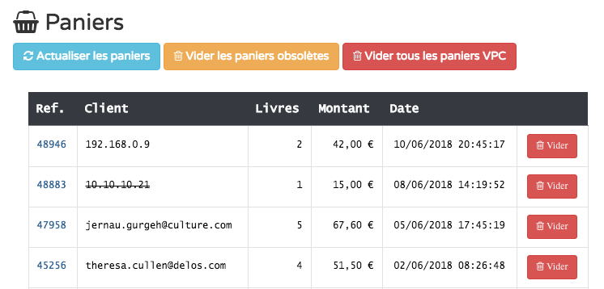

La page **Paniers** de l'administration permet de gérer les paniers créés par les visiteurs qui n'ont pas
encore été validés, donc pas encore été transformés en commande.

Pour chaque panier, sont indiqués :

* l'identifiant unique du panier ;
* l'identité du client (cf. ci-dessous) ;
* le nombre d'articles dans le panier ;
* le montant total du panier ;
* et la date de dernière activité (ajout ou suppression d'un article).

Dans la colonne **Client**, apparaît l'adresse e-mail de l'utilisateur si celui-ci était identifié lors de la création
du panier, et dans le cas contraire, son adresse IP. Dans le cas où le client est identifié, celui-ci peut retrouver son
panier sur le site en s'identifiant à nouveau sans limite de temps. Dans le cas d'un panier anonyme, le client pourra
retrouver son panier jusqu'à la fermeture de son navigateur.

Un panier anonyme sera considéré comme obsolète et l'identité du client apparaîtra barrée vingt-quatre heures après la
date de dernière activité. On peut alors considérer que la commande ne sera plus transformée et que le panier peut être
vidé. À noter qu'un message invite le client anonyme à s'identifier s'il souhaite conserver son panier sans le valider
lorsqu'il quitte le site.

* Vous pouvez utiliser le bouton **Actualiser les paniers** permet de mettre à jour les colonnes **Livres** et **Montant**
  si vous constatez une incohérence après avoir mis à jour manuellement un panier.
* Le bouton **Vider les paniers obsolètes** permet de supprimer tous les paniers anonymes apparaissant comme barrés.
* Le bouton **Vider tous les paniers VPC** supprime l'ensemble des paniers affichés, sans discrimination. Les paniers
  magasins ne sont pas affectés.
