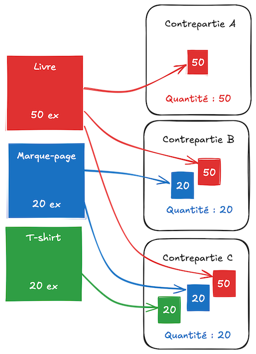
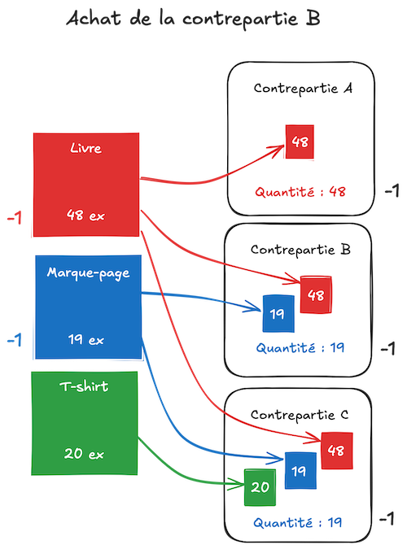

Vous avez décidé de faire appel à votre communauté pour financer un projet ? Biblys peut vous aider à gérer une campagne
de financement participatif. Mais avant de vous lancer avec Biblys, vous devriez connaître certaines spécificités du
logiciel pour décider si c'est le bon outil pour vous.

## Les spécificités Biblys

Biblys propose une fonctionnalité de financement participatif relativement classique, avec un objectif, une durée et des
contreparties, mais diffère des plateformes classiques sur plusieurs aspects.

### L'intégration à la boutique

Sur une plateforme de financement participatif classique, les contributeur·ices ne peuvent acheter que les contreparties
proposées dans le cadre de la campagne.

Sur Biblys, le financement participatif utilise le panier et le même système de commande que la boutique classique. À
moins de créer un site Biblys dédié au financement participatif, les contributeur·ices pourront donc ajouter à leur
commande, en plus des contreparties choisies dans le cadre de la campagne, n'importe quel article du catalogue. Ceci
étant dit, seul les articles ajoutés via une contrepartie seront comptabilisés pour l'atteinte de l'objectif.

Cela peut sembler être un avantage, mais il faut avoir en tête les complications suivantes :

- il vous faudrait soit faire deux expéditions (une première fois pour les articles classiques, une seconde fois pour
  les articles de la campagne de financement) soit avertir vos client·es que les commandes seront expédiées à la fin de
  la campagne ;
- en cas d'échec de la campagne, il faudra modifier les commandes pour en retirer les articles spécifiques à la campagne
  de financement et expédier uniquement les articles de la boutique.

### Le paiement

Sur une plateforme de financement participatif classique, les contributeur·ices enregistrent un moyen de paiement qui
est débité à la fin de la campagne, uniquement si celle-ci est réussie.

Sur Biblys, les client·es ont la possibilité de payer leur commande dès que celle-ci est enregistrée. En cas d'échec de
la campagne, il vous faudra donc rembourser les contributeur·ices manuellement. Il faut également vous assurer que la
durée de la campagne n'excède pas la période pendant laquelle votre prestataire de paiement autorise les remboursements.

### Les quantités disponibles

Sur une plateforme de financement participatif classique, chaque contrepartie est disponible en une certaine quantité
et chaque participation incluant cette contrepartie décrémente sa quantité de 1.

Sur Biblys, les contreparties sont liées aux notions d'articles et d'exemplaires. Une contrepartie est composée d'un ou
de plusieurs articles, auxquels sont associées un certain nombre d'exemplaires. La quantité disponible pour une
contrepartie est déterminée par l'article de la contrepartie qui possède le plus petit nombre d'exemplaires.

Imaginons, par exemple, une campagne de financement participatif proposant deux contreparties :

- une contrepartie A contenant uniquement un article "Livre"
- une contrepartie B contenant l'article "Livre", mais aussi un article "Marque-page"
- une contrepartie C contenant les articles "Livre" et "Marque-page" et un article "T-shirt"

50 exemplaires de "Livre" sont ajoutés au stock, 20 exemplaires de "Marque-page" et 20 exemplaires de "T-shirt". Au
début de la campagne, la quantité disponible de la contrepartie A sera de 50, car il y a 50 exemplaires de "Livre"
disponibles. La quantité de la contrepartie B sera de 20, car même s'il y a 50 exemplaires de "Livre", il n'y a que 20
exemplaires de "Marque-page". Pour la même raison, la quantité de contrepartie C sera de 20, autant que de "Marque-page"
et de "T-shirt".

**Les stocks d'un même article est partagée entre toutes les contreparties, si bien que l'achat d'une contrepartie peut
affecter la quantité disponible des autres.** Si une contrepartie A est achetée, un exemplaire sera retiré du stock de
l'article "Livre", et son stock ne sera plus que de 49 exemplaires. La quantité disponible pour la contrepartie A sera
également de 49, mais les autres contreparties ne seront pas affectées.

Si ensuite, une contrepartie B est achetée, un article "Livre" et un article "Marque-page" seront retirés du stock, il
n'y aura plus que 48 exemplaires de l'article "Livre", ce qui affectera la quantité disponible contrepartie A, et il n'y
aura plus que 19 exemplaires de l'article "Marque-page", ce qui affectera la contrepartie B, mais aussi la C, puisque
l'article "Marque-page" deviendra celui qui a le plus petit nombre d'exemplaires dans cette contrepartie. 

