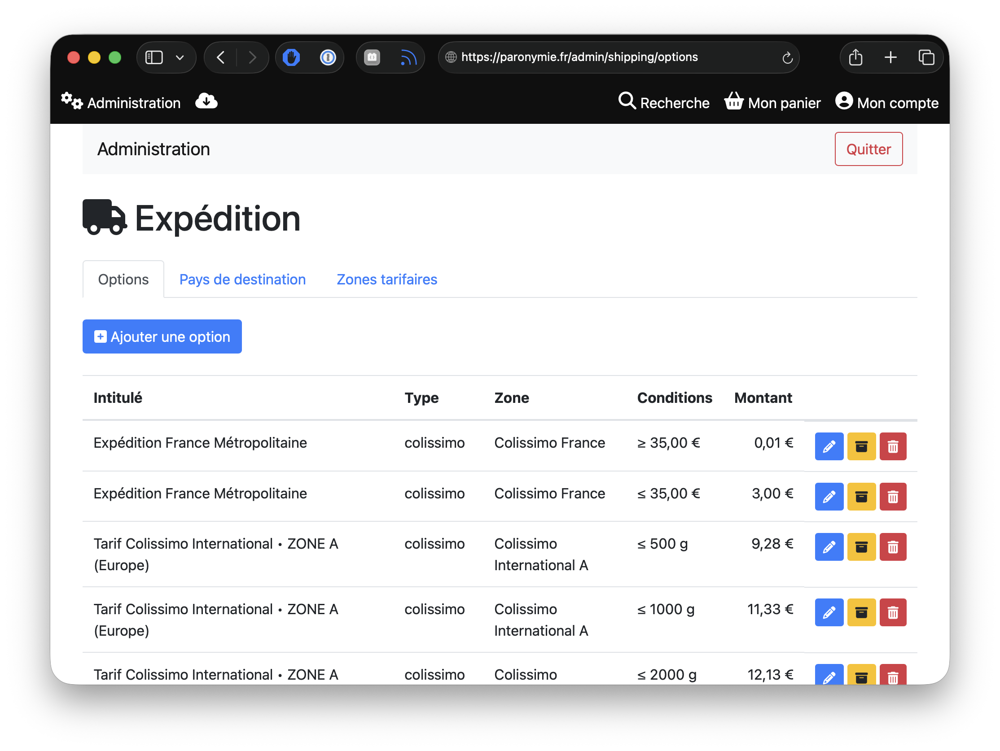
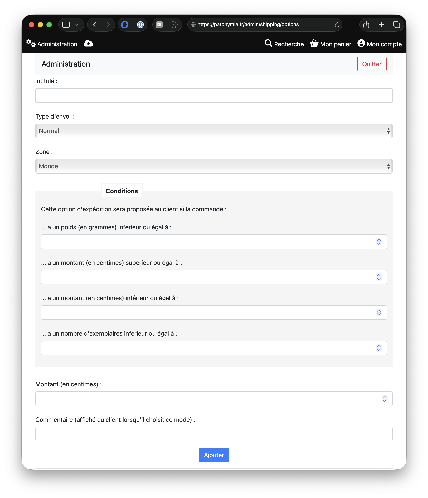
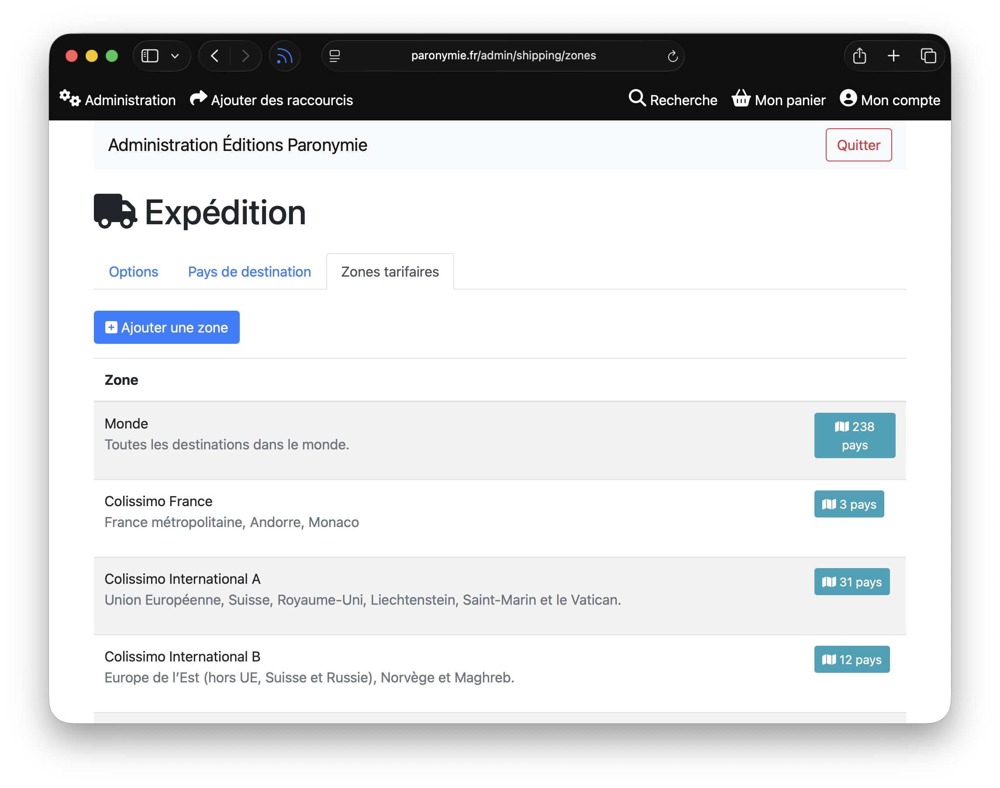
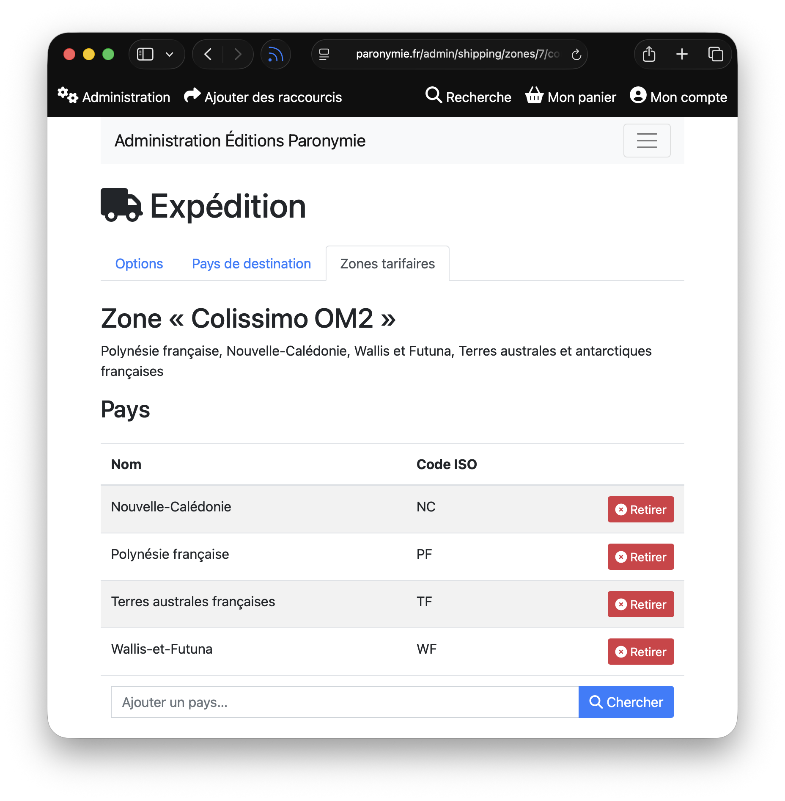
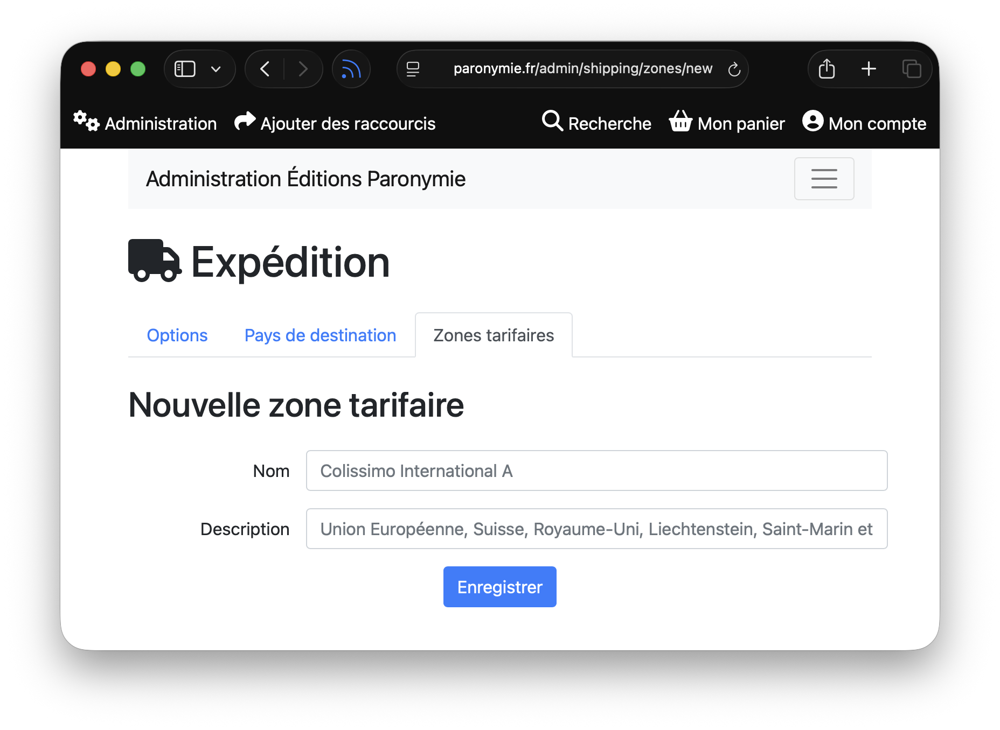

import TrashIcon from '~icons/fa6-solid/trash-can';
import EditIcon from '~icons/fa6-solid/pencil';
import BoxIcon from '~icons/fa6-solid/box-archive';

Biblys vous permet de configurer finement les frais de port appliquées aux commandes grâce aux options d'expédition.

Lorsqu'un·e client·e passe une commande, il·elle peut choisir parmi une liste d'options d'expédition. Les options
proposées dépendent de certains critères comme la zone géographique de destination, le poids total de la commande,
le nombre d'articles ou son montant.

Sur la page **Expédition** > **Options** de l'administration, vous pouvez créer autant d'options que vous le souhaitez,
et pour chacune d'elles, de définir les conditions d'application du tarif.

## Ajouter une option d'expédition

En cliquant sur **Ajouter une option**, vous pourrez pour créer une nouvelle option d'expédition.

Les champs à remplir sont les suivants :

* **Intitulé** : le nom de l'option d'expédition, qui sera affiché à l'utilisateur·ice lors de la commande.
* **Type d'envoi** : le type de transporteur ou de service d'expédition (par exemple, "Colissimo", "Mondial Relay",
etc.).
* **Zone géographique** : la zone géographique à laquelle s'applique cette option. L'option ne sera proposée à l'
utilisateur·ice que si son pays correspond à cette zone.
* **Conditions** : les conditions d'application de l'option, qui peuvent être basées sur le poids total de la commande,
le nombre d'articles ou le montant total de la commande.
* **Montant (en centimes)** : le tarif de cette option, qui sera ajouté au montant total de la commande si
l'utilisateur·ice choisit cette option.

Cliquer sur **Ajouter** pour enregistrer la nouvelle option. Celle-ci est effective immédiatement.

## Modifier ou supprimer une option d'expédition

Une option d'expédition qui n'a jamais été utilisée pour une commande peut être supprimée à l'aide du bouton
<TrashIcon class="icon" /> ou modifiée à l'aide du bouton <EditIcon class="icon"/>.

:::caution[Options d'expédition utilisées]
Une option d'expédition qui a déjà été utilisée pour une commande ne peut être supprimer ou modifiée, car cela
provoquerait des incohérences dans ces commandes.
:::

Si vous souhaitez supprimer une option d'expédition qui a déjà été utilisée, vous pouvez l'archiver en cliquant sur le
bouton <BoxIcon class="icon" />. L'option ne sera plus proposée aux utilisateur·ices pour les nouvelles commandes, mais
restera visible dans l'historique des commandes.

Si vous souhaitez modifier une option d'expédition qui a déjà été utilisée, archivez-la d'abord en cliquant sur le
bouton <BoxIcon class="icon" />, puis créez une nouvelle option avec les mêmes caractéristiques.

## Gestion des zones d'expédition

Chaque option d'expédition est associée à une zone géographique, laquelle regroupe plusieurs pays. Cela évite d'avoir à
définir individuellement des options pour des pays pour lesquels les tarifs d'expédition sont identiques.

À l'installation de Biblys, les zones d'expédition correspondant au tarif Colissimo International sont crées, mais il
est possible de modifier d'ajouter ou de retirer un pays à une zone tarifaire.

Enfin, il est possible de créer de nouvelles zones tarifaires en cliquant sur le bouton **Ajouter une zone**, de manière
à regrouper les pays selon les grilles d'expédition d'un autre service ou transporteur.

