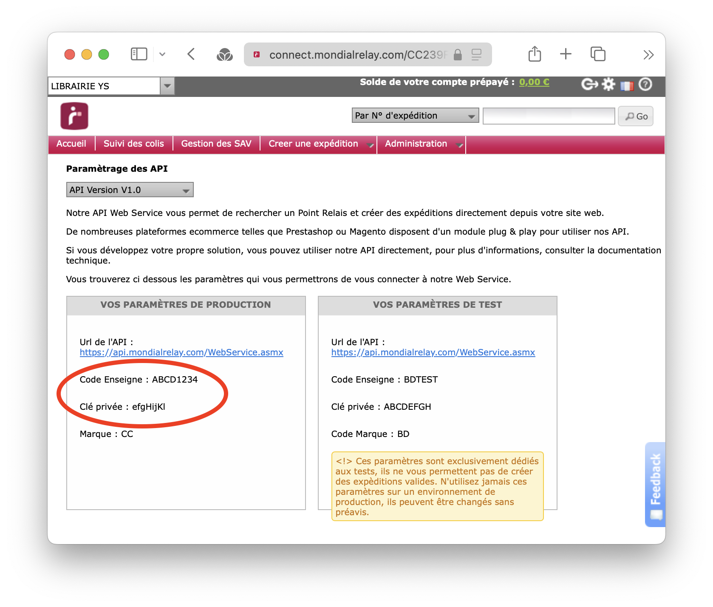

L'option d'expédition Mondial Relay permet aux client·es de votre site de rechercher un point relais dans une liste à 
partir d'un code postal.


## Configurer Mondial Relay

Pour configurer Mondial Relay sur votre site Biblys, vous devez obtenir deux chaînes de caractères (clés API) : le 
**code enseigne** et la **clé privée**.

### Étape 1 : récupérer les clés API Mondial Relay

1. Créer [un compte Mondial Relay professionnel](https://www.mondialrelay.fr/connexion-inscription/?returnUrl=https://www.mondialrelay.fr/)
2. Se rendre sur le site [Mondial Relay Connect](https://connect.mondialrelay.com/YETI/Account/LogOn?ReturnUrl=%2fCC239FXF)
3. S'identifier
4. Dans le menu déroulant **Administration**, sélectionner **Configuration des API**


5. Sur la page "Paramétrage des API", copier le **Code Enseigne** et la **Clé privée** 



### Étape 2 : activer Mondial Relay sur le site

Si vous utilisez Biblys dans le cadre de l'abonnement Biblys, ou si quelqu'un gère techniquement votre site Biblys pour
vous, vous pouvez lui [transmettre les clés API de manière sécurisée](/tutoriels/transmettre-des-informations-confidentielles-de-maniere-securisee/).

Sinon, vous devez ajouter ces clés à la configuration en modifiant le fichier `config.yml` comme ceci:

```yaml
mondial_relay:
  code_enseigne: ABCD1234
  private_key: efgHijKl
```

### Étape 3 : créer un tarif Mondial Relay

L'outil de sélection du point de retrait Mondial Relay est désormais configuré sur votre site, mais pour que vos 
client·es puisse choisir ce mode d'expédition, vous devrez créer une tranche tarifaire Mondiale Relay pour l'expédition.

1. Rendez-vous sur la page **Frais de port** de l'administration de votre site
2. Cliquez sur le bouton **Ajouter une tranche**
3. Pour le **Type d'envoi**, choisissez "Mondial Relay"


4. Vous êtes libre de définir les autres caractéristiques (conditions, tarifs) selon votre politique de frais de port.


