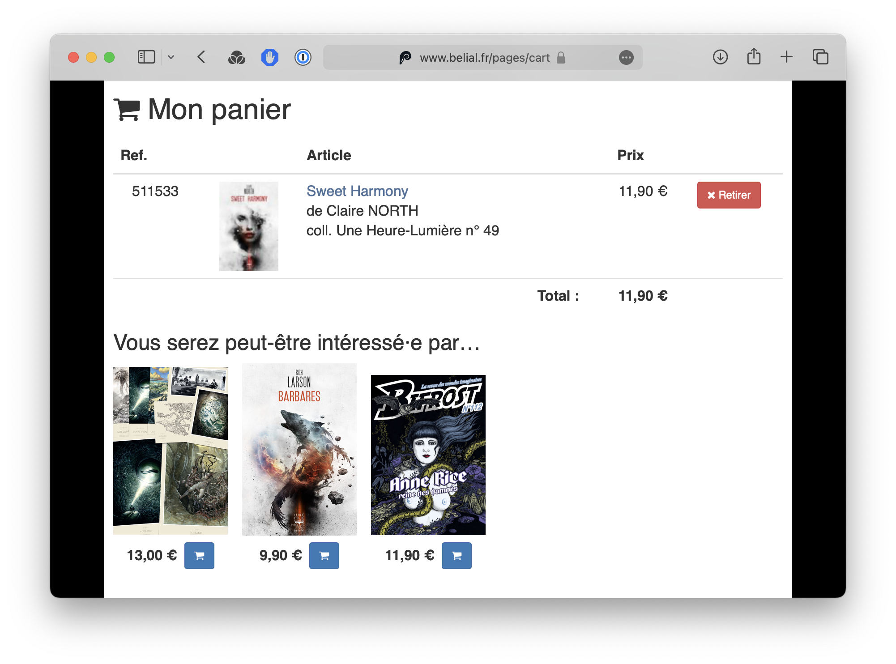
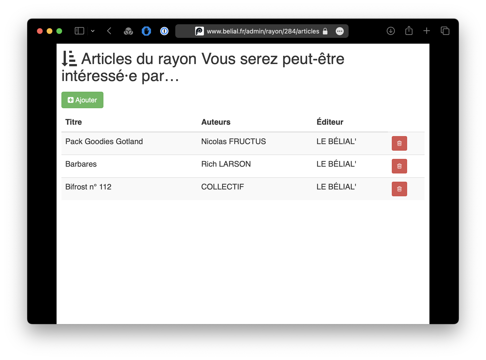
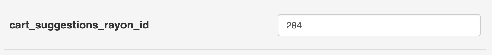

Il est possible, sur la page du panier, d’afficher une liste d’articles suggérés.

Elle peut être utilisée pour mettre en avant certains titres comme des nouveautés, des livres à petits prix pour
atteindre le montant minimum pour bénéficier de la gratuité du port, ou des goodies.

Pour faire apparaître des articles dans les suggestions du panier, il faut d’abord créer un nouveau rayon et y ajouter
les articles. C’est le titre qui servira d’annonce sur la page du panier.

Ensuite, créer une nouvelle option de site avec pour clé `cart_suggestions_rayon_id` et pour valeur l’identifiant du
rayon. Les articles ajoutés au rayon apparaîtront alors sur la page du panier.

