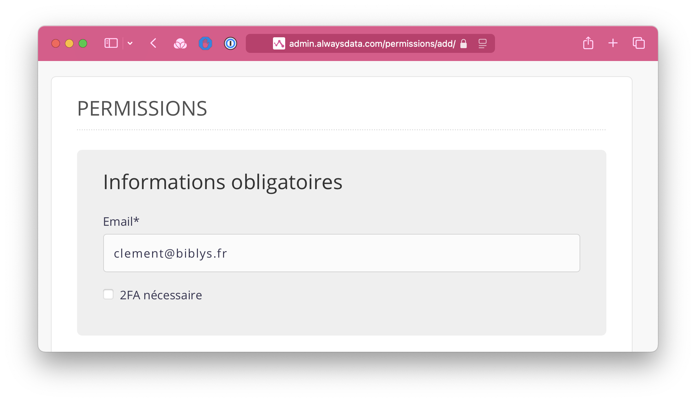
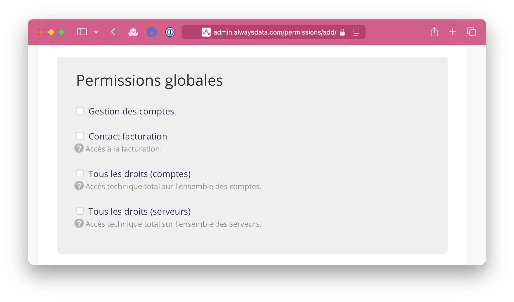
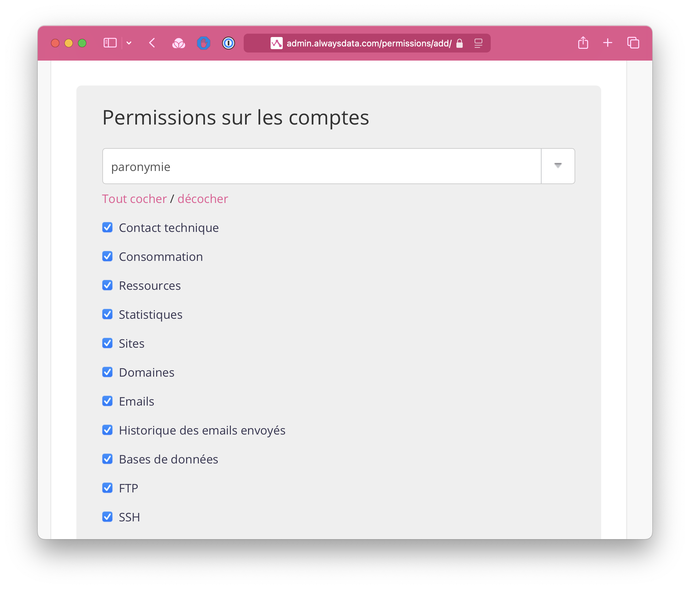

:::tip[Vous n'avez pas de compte ?]
Commencez [par créer votre compte alwaysdata](https://www.alwaysdata.com/fr/inscription/?from=215e2fb8) en quelques clics.
:::

Accorder un accès technique à un hébergement alwaysdata permet de donner les droits de configuration de l'hébergement à un tiers sans pour autant qu'il soit propriétaire ou contact de cet hébergement.

1. Se connecter à l'**[espace client alwaysdata](https://admin.alwaysdata.com/login/)**.
2. Cliquer en haut à droite sur le menu **Espace client** puis sur **[Permissions](https://admin.alwaysdata.com/permissions/)**.
3. Cliquer sur le bouton **[Ajouter un utilisateur](https://admin.alwaysdata.com/permissions/add/)**.
4. Dans la section *Informations obligatoires*, entrer `clement@biblys.net` dans le champ **email**.

5. Ne rien cocher dans la section *Permissions globales*.

6. Dans la section *Permissions sur les comptes*, sélectionner le compte à partager.
7. Dans la même section, cliquer sur **Tout cocher**.

8. En bas de page, cliquer sur **Valider**.
