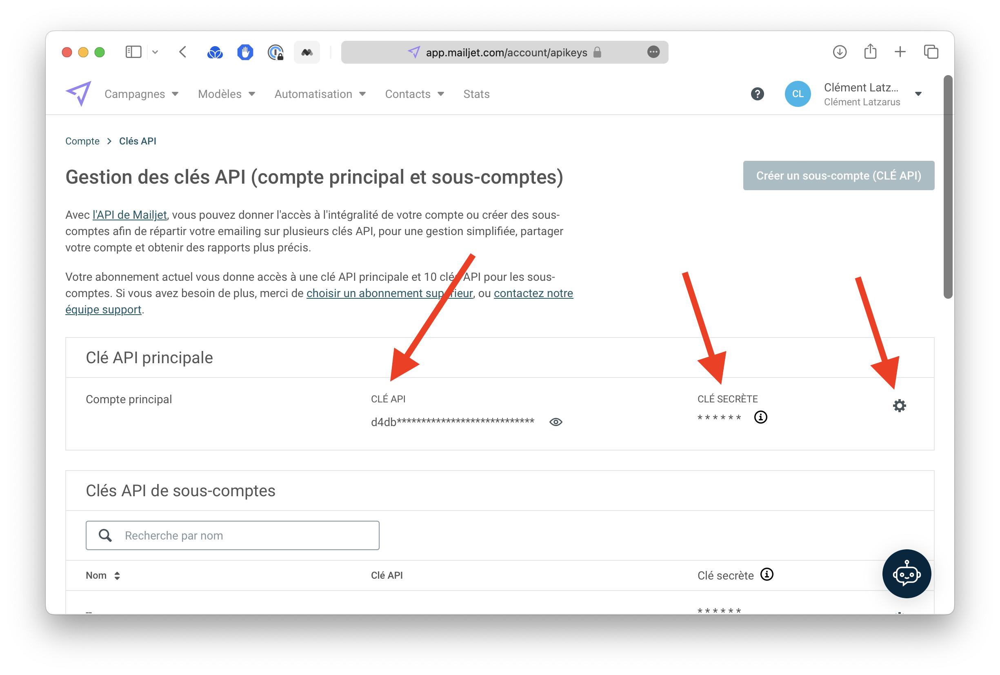
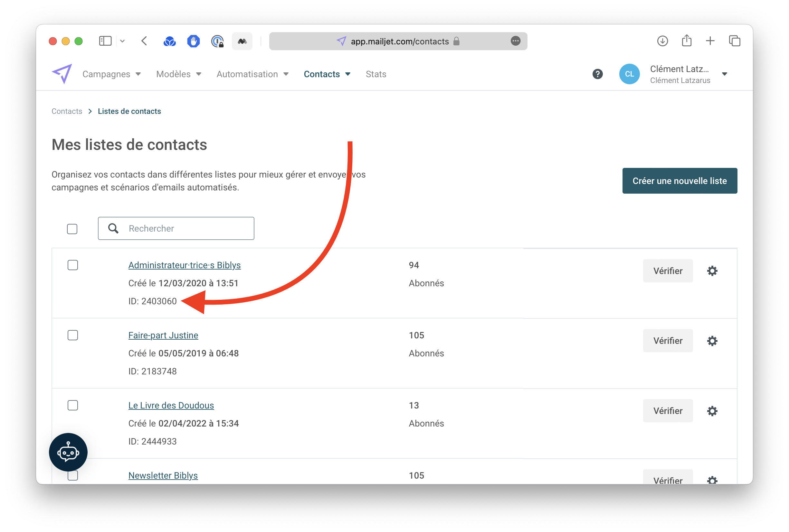

Pour configurer votre site Biblys de manière à ce qu'il puisse ajouter un nouveau contact à une liste Mailjet, vous aurez besoin de trois informations :
- Clé API
- Clé secrète
- Identifiant de liste

Voici comment récupérer ces informations.

## Clé API et clé secrète

Se rendre sur la page [Gestion des clés API](https://app.mailjet.com/account/apikeys) :

Si la clé secrète est masquée, cliquer sur la petite roue dentée à droite et demander à la régénérer.

## Identifiant de liste

Se rendre sur la page [Liste de contacts](https://app.mailjet.com/contacts) et récupérer l’ID qui s’affiche sous la liste à utiliser :

Vous pouvez ensuite [transmettre ces informations de manière sécurisée](/tutoriels/transmettre-des-informations-confidentielles-de-maniere-securisee/).
