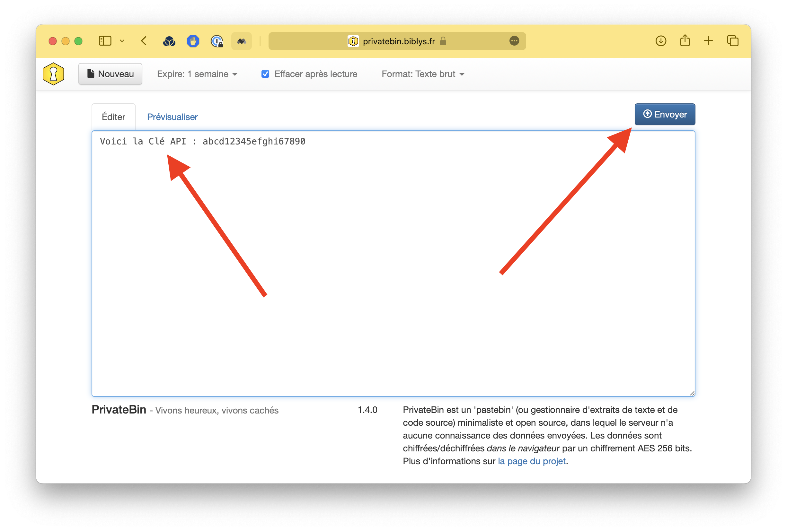
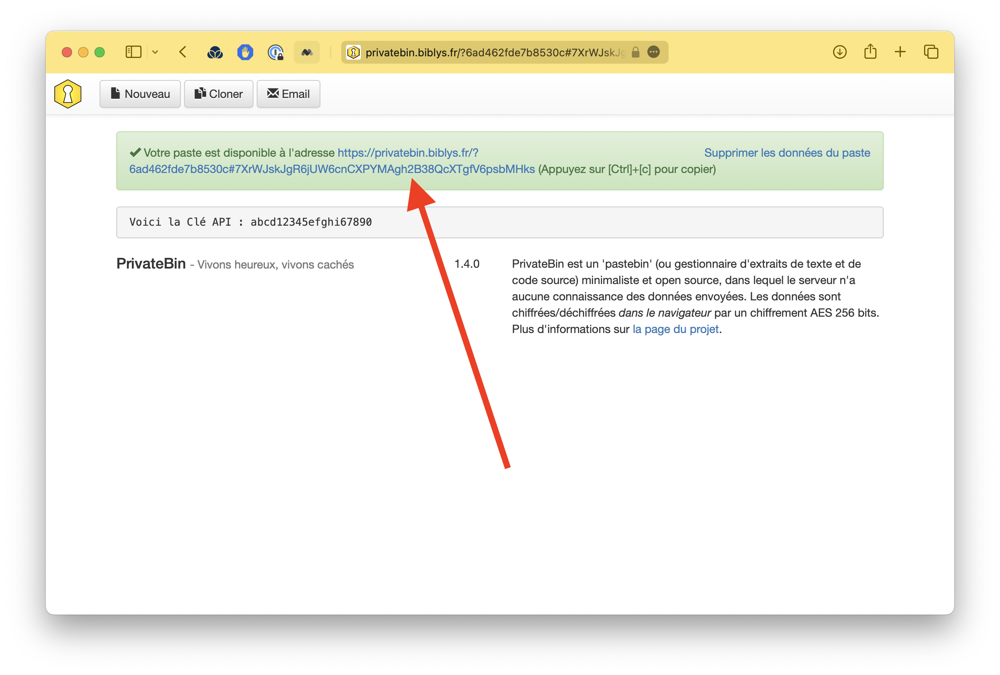

**Il ne faut jamais envoyer un mot de passe, une clé API ou un identifiant par e-mail.**  
Pour transmettre des informations confidentielles, vous pouvez utiliser l'outil open-source PrivateBin, qui vous
fournira un lien sécurisé qui pourra, lui être transmis par e-mail.

:::note[En quoi est-ce plus sécurisé ?]
Un lien PrivateBin expire une semaine après avoir été créé ou immédiatement après avoir été cliqué. Le destinataire peut
ainsi être sûr qu'il n'a été consulté par personne d'autre que lui (dans le cas contraire, le lien aura expiré).  
À l'inverse, un e-mail peut rester indéfiniment dans une boîte mail ou sur un serveur, et il est impossible de s'assurer
qu'il n'a pas été intercepté et lu par un tiers.
:::

## Comment utiliser PrivateBin

1. Se rendre sur le site https://privatebin.biblys.fr.
2. Entrez le texte à transmettre dans le champ texte puis cliquer sur **Envoyer**.

Le site PrivateBin fournit alors un lien de partage sécurisé à transmettre.

3. Cliquer sur le bouton **Email** pour ouvrir un message pré-rempli dans votre logiciel de messagerie ou bien copier le
   lien avec <kbd>Ctrl</kbd> + <kbd> C</kbd> (ou <kbd>Cmd</kbd> + <kbd>C</kbd> sur Mac) pour le transmettre par un autre
   moyen.

:::caution[Attention]
Ce ne peut être cliqué qu'une seule fois. Il faut donc prendre garde à le copier-coller sans cliquer dessus, sans quoi
il ne sera plus valable. De plus, il expire une semaine après sa création.
:::

